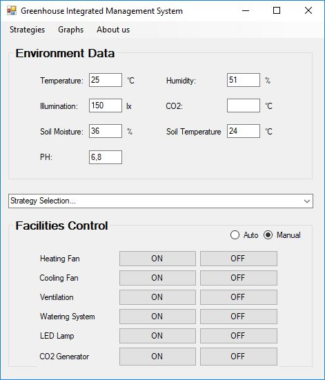

# Intelligent Greenhouse Management System

## Project review

#### Features

The software contains the following features:
- Collection of temperature data. Checking the air and soil temperature in the greenhouse
- Collection of humidity data
- Collection of CO2 concentration data
- Collection of data on greenhouse lighting
- Collection of data from outside the greenhouse. Collection of temperature, humidity and luminosity data
- Comparison of the obtained data. Comparing indoor and outdoor data to determine whether or not to increase parameter values ​​(eg temperature, brightness, etc.)
- Retention of collected data for a long time. Saving measurements made in a data store in order to establish a statistic of parameter fluctuations.
- Processing comparisons according to the current profile
- Possibility to create plant-specific profiles. Creating a file describing the values ​​of the optimal parameters for efficient plant growth.
- Possibility to use existing profiles
- Possibility to exchange between profiles
- Possibility to export profiles
- Detection of errors in measurements made by measuring devices. Detection of errors by comparing both internal and external values ​​with the averages set by all sensors.
- Creating an interface as universal as possible
- Possibility to extend the system. Possibility to add new sensors
- The possibility of adapting the system to the innovations made in the field. Adapting to innovations with minimal changes to the existing system.
- Recording of actions performed in the system. Keeping user actions in files so you can track and process them. Notification of established defects

## Screens

